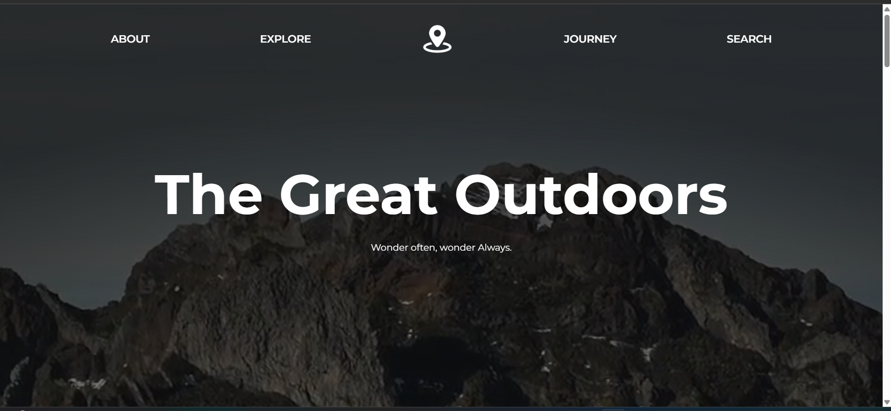

# 🏕️ Outdoor Travel React

A modern, responsive travel and outdoor adventure website built using **React**, styled with **Tailwind CSS**, and animated with **Framer Motion**. This project showcases destinations, adventure tours, and engaging UI animations.

## 🚀 Features

- 🗺️ Travel destination cards with images and descriptions
- 🧭 Smooth page transitions using Framer Motion
- 📱 Responsive design for mobile, tablet, and desktop
- 🌙 Dark mode toggle (optional)
- 🔍 Search/filter for destinations (optional)
- 🎯 Clean component-based architecture

## 🛠️ Built With

- [React](https://reactjs.org/) – UI library
- [Tailwind CSS](https://tailwindcss.com/) – Utility-first CSS
- [Framer Motion](https://www.framer.com/motion/) – Animation library

## 📦 Installation

Clone the repository and install dependencies:

```bash
git clone https://github.com/your-username/outdoor-travel-react.git

cd outdoor-travel-react

npm install

npm run dev


outdoor-travel-react/
├── public/
├── src/
│   ├── assets/
│   ├── components/
│   ├── pages/
│   ├── App.jsx
│   ├── main.jsx
├── tailwind.config.js
├── package.json
└── README.md

```

---

## 📸 Screenshots


